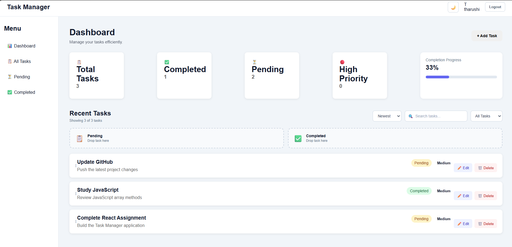
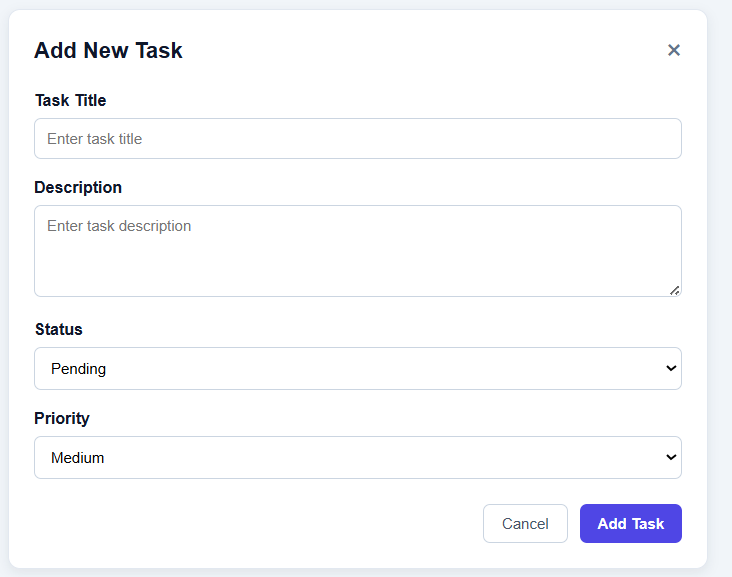
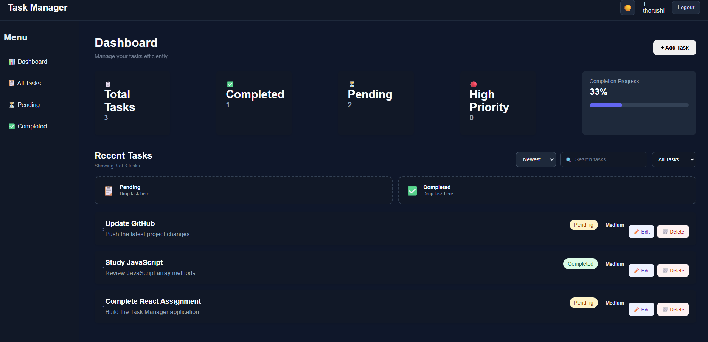
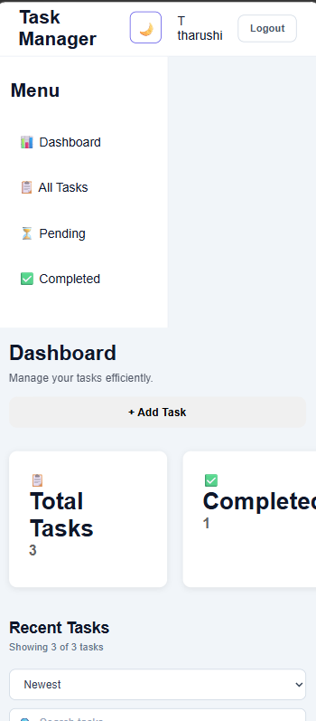

# 📋 Task Manager - Modern React Task Management Application

Task Manager is a modern, responsive task management web application built with React.js.

The project focuses on creating a professional productivity dashboard where users can create, edit, delete, organize, search, filter, sort, and track their tasks through an intuitive user interface.

The application also includes authentication flow, task priorities, drag-and-drop status management, dashboard analytics, dark/light mode, Local Storage persistence, and responsive design.

---

## ✨ Features

### 🔐 Authentication

- User login
- User registration / Sign Up
- Logout functionality
- User information stored using Local Storage
- Authentication state persists after refreshing the page

### 📊 Dashboard

- Modern task management dashboard
- Total tasks statistics
- Completed tasks statistics
- Pending tasks statistics
- High priority task statistics
- Task completion percentage
- Visual completion progress bar
- Real-time dashboard updates

### ➕ Create Tasks

- Create new tasks
- Task title
- Task description
- Task status
- Task priority
- Form validation
- Automatic task ID generation

### ✏️ Edit Tasks

- Edit existing tasks
- Update task title
- Update task description
- Update task status
- Update task priority
- Changes reflected immediately on the dashboard

### 🗑️ Delete Tasks

- Delete existing tasks
- Delete confirmation dialog
- Task statistics update automatically after deletion

### 🎯 Task Priority

Tasks can be assigned different priority levels:

- 🔴 High
- 🟡 Medium
- 🟢 Low

Priority badges are displayed directly on task cards.

### 🔄 Drag & Drop

- Drag tasks between task sections
- Move tasks from Pending to Completed
- Move tasks from Completed to Pending
- Task status updates automatically
- Dashboard statistics update after status changes

### 🔎 Search

- Search tasks by title
- Real-time search results
- Works together with task filtering and sorting

### 🔽 Task Filtering

Users can filter tasks by:

- All Tasks
- Pending
- Completed

### ↕️ Task Sorting

Tasks can be sorted using multiple options:

- Newest
- Oldest
- Title A-Z
- Priority
- Status

Priority sorting follows:

```text
High
Medium
Low
```

### 📈 Dashboard Analytics

The dashboard provides real-time task analytics including:

- Total task count
- Completed task count
- Pending task count
- High priority task count
- Completion percentage
- Visual completion progress

### 🌙 Theme Support

- Dark mode
- Light mode
- Theme preference saved using Local Storage
- Theme persists after refreshing the page

### 💾 Local Storage

Task information is stored using the browser's Local Storage API.

The application can preserve:

- Tasks
- Task status
- Task priority
- User authentication state
- User information
- Theme preference

Data remains available after refreshing the browser.

### 📱 Responsive Design

The application is designed to work across:

- 💻 Desktop
- 💻 Laptop
- 📱 Tablet
- 📱 Mobile

The interface automatically adapts to different screen sizes.

---

## 🛠️ Technologies Used

- React.js
- JavaScript (ES6+)
- HTML5
- CSS3
- Vite
- React Hooks
- Local Storage API
- Drag and Drop API
- Responsive Web Design
- Git
- GitHub

---

## 📁 Project Structure

```text
react-task-manager/
│
├── screenshots/
│   ├── dashboard.png
│   ├── add-task.png
│   ├── dark-mode.png
│   └── mobile.png
│
├── src/
│   │
│   ├── components/
│   │   ├── AddTaskForm.jsx
│   │   ├── EditTaskForm.jsx
│   │   ├── LoginPage.jsx
│   │   ├── Navbar.jsx
│   │   ├── Sidebar.jsx
│   │   ├── TaskCard.jsx
│   │   └── TaskStats.jsx
│   │
│   ├── pages/
│   │   ├── LoginPage.jsx
│   │   └── SignUpPage.jsx
│   │
│   ├── styles/
│   │   └── main.css
│   │
│   ├── App.jsx
│   └── main.jsx
│
├── public/
│
├── index.html
├── package.json
├── package-lock.json
├── README.md
└── .gitignore
```

---

## 🚀 How to Run

### 1. Clone the repository

```bash
git clone https://github.com/Avish-Tharu/react-task-manager.git
```

### 2. Open the project folder

```bash
cd react-task-manager
```

### 3. Open the project in Visual Studio Code

```bash
code .
```

### 4. Install dependencies

```bash
npm install
```

### 5. Start the development server

```bash
npm run dev
```

### 6. Open the application

Open the following address in your browser:

```text
http://localhost:5173/
```

---

## 💻 Usage

After opening the application, users can:

1. Register a new account.
2. Log into the Task Manager.
3. View the dashboard.
4. View task statistics.
5. Create new tasks.
6. Assign task status.
7. Assign task priority.
8. Edit existing tasks.
9. Delete tasks.
10. Search for tasks.
11. Filter tasks by status.
12. Sort tasks using different sorting options.
13. Drag and drop tasks between Pending and Completed.
14. View task completion progress.
15. Switch between dark and light mode.
16. Refresh the application while keeping saved tasks through Local Storage.
17. Use the application on desktop, tablet, and mobile devices.

---

## 🎨 Design Highlights

The Task Manager was designed with a modern productivity dashboard aesthetic focusing on:

- Clean visual hierarchy
- Professional dashboard layout
- Consistent spacing
- Modern task cards
- Clear status indicators
- Priority badges
- Dashboard analytics
- Visual progress tracking
- Interactive controls
- Responsive layouts
- Dark and light themes
- User-friendly navigation
- Mobile-friendly interface

The goal was to create a realistic task management application rather than a simple CRUD demonstration.

---

## 📊 Dashboard Analytics

The dashboard provides users with an overview of their task progress.

### Total Tasks

Displays the total number of tasks currently stored in the application.

### Completed Tasks

Displays the number of tasks marked as completed.

### Pending Tasks

Displays the number of tasks that still need to be completed.

### High Priority

Displays the number of high-priority tasks.

### Completion Progress

The dashboard calculates the percentage of completed tasks and displays the result using a visual progress bar.

---

## 🎯 Task Organization

The application provides multiple ways to organize tasks.

### Search

Users can search tasks by their title.

### Filter

Users can filter tasks based on their current status.

### Sort

Users can organize tasks using:

- Newest
- Oldest
- Title A-Z
- Priority
- Status

This allows users to quickly find and organize tasks based on their needs.

---

## 🔄 Drag & Drop Workflow

The application provides a simple drag-and-drop workflow for task status management.

```text
Pending Tasks
      │
      │ Drag & Drop
      ▼
Completed Tasks
```

Tasks can also be moved back from Completed to Pending.

The dashboard statistics and completion progress automatically update when the task status changes.

---

## 💾 Data Persistence

The application uses the browser's Local Storage API to persist important application data.

Stored information includes:

- Task data
- Task status
- Task priority
- Authentication state
- User information
- Theme preference

This allows users to refresh the browser without losing their current task information.

---

## 📱 Responsive Design

The application adapts to different screen sizes.

### 💻 Desktop

Provides a full dashboard experience with:

- Sidebar navigation
- Dashboard statistics
- Task controls
- Task cards
- Drag-and-drop sections

### 📱 Mobile

The layout adapts by:

- Hiding unnecessary desktop navigation
- Stacking dashboard statistics
- Expanding search and filter controls
- Making task cards fit smaller screens
- Maintaining readable buttons and forms

---

## 📸 Screenshots

### 📊 Dashboard



### ➕ Add Task



### 🌙 Dark Mode



### 📱 Mobile Responsive Design



---

## 🌟 Future Improvements

The current project focuses primarily on the front-end experience. The following features could be added in future versions:

- 🔐 Backend authentication
- 🗄️ Database integration
- 🌐 REST API integration
- 👤 User profile management
- 📅 Task due dates
- 🏷️ Task categories and tags
- 🔔 Task notifications
- 📧 Email notifications
- 📊 Advanced analytics dashboard
- 👥 Team collaboration
- 💬 Task comments
- 📎 File attachments
- 🔍 Advanced task search
- 📈 Productivity reports
- ☁️ Cloud-based data synchronization
- 🚀 Production deployment

---

## 📚 Learning Outcomes

Through this project, I practiced and improved my skills in:

- React component development
- React Hooks
- State management
- Props and component communication
- Event handling
- Conditional rendering
- Form handling
- CRUD operations
- Local Storage
- Drag and Drop API
- Search functionality
- Filtering
- Sorting algorithms
- Dashboard analytics
- Responsive web design
- CSS layouts
- Dark mode implementation
- User authentication flow
- Git and GitHub workflow
- Front-end project organization

---

## 👨‍💻 Author

**Tharushi**

Software Engineering Student

GitHub:

https://github.com/Avish-Tharu

---

## 📄 License

This project was developed for educational purposes.